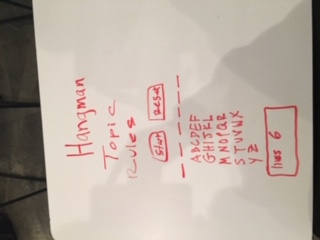
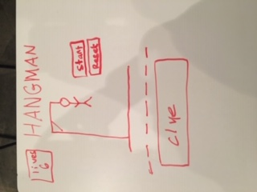

# Project 1 - Hangman

Hangman is a simple game where you guess certain letters that go into a word on the lines provided. You are given 6 tries to guess the word or you lose. If you guess all the letters in the word correctly, a word will appear and you win.

These are my ideas that i wanted to accomplish at first and also my goals for the project in the future.

This is my Trello board, i got most of my objectives done but not all of them.
<a href="https://trello.com/b/3jNRhuxu/seth">Trello</a>
